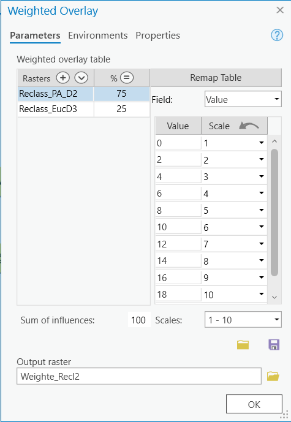
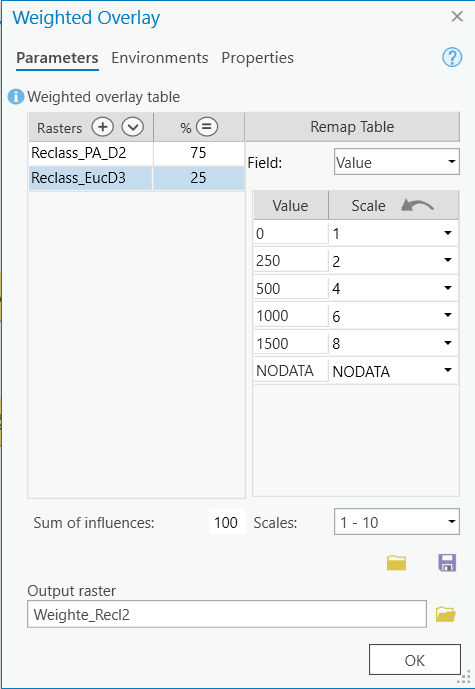

# Weighted Overlay

Use the weighted overlay tool to create an Inundation Risk layer.  You should complete these general steps.  Refer to the short video at the bottom of the page for reference.

**1**{: .label .label-red } Add the weighted overlay tool to the model and set the reclassified layers as the inputs.

**2**{: .label .label-red } Set the weights for the **Elevation Layer** layer following the image below.  Elevation should have a weight of 75%.

**3**{: .label .label-red } Set the weights for the **Distance** following the image below.  Distance should have a weight of 25%.

**4**{: .label .label-red } Inspect the output to make sure it makes sense.

<iframe width="560" height="315" src="https://www.youtube.com/embed/4DbRt0I3Qjw" title="YouTube video player" frameborder="0" allow="accelerometer; autoplay; clipboard-write; encrypted-media; gyroscope; picture-in-picture" allowfullscreen></iframe>