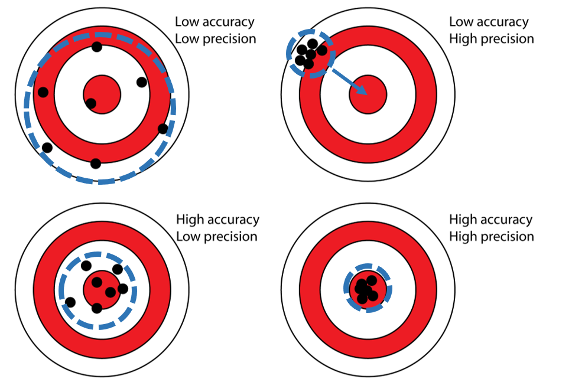
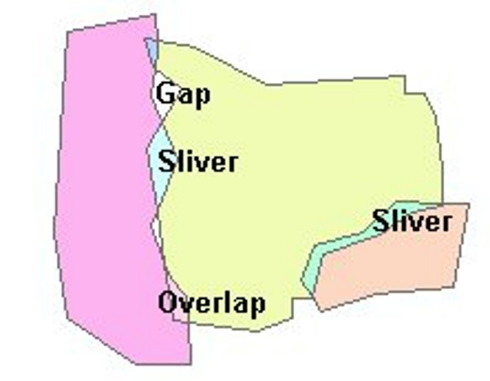

<!-- 

 -->

# Unertainty in GIS

<!-- # Error, Spatial Bias, Logical Fallacies -->
<!-- {: .no_toc } -->

<!-- See [**this link**](https://github.com/June-Skeeter/Module6_GEOS270/blob/main/docs/content/Nov_17.pdf) for a .pdf copy of the lecture (*note the formatting is not perfect*)

See [**this link**](https://github.com/June-Skeeter/Module6_GEOS270/blob/main/docs/content/Error_Examples.zip) if you would like a copy of the ArcPro Error_Examples project file to play around with on your own. -->

  <iframe src="content/Uncertainty.html" title="Processes" scrolling="no" frameborder="0"
    style="border: 0;
   height: 100%;
   left: 0;
   position: absolute;
   top: 0;
   width: 100%;">
   
Your browser does not support iframes.

 </iframe>

<a href="content/Uncertainty.html" target="_blank">View Slides in New Tab</a>

<!-- 

  

    Table of contents
  

  {: .text-delta }
1. TOC
{:toc}

 -->

<!-- 
## Data Quality in GIS

A measure of how good a particular dataset is to your needs.  It is **up to GIS users** to assess data and determine if it is appropriate.  Unlike say ... baking, GIS products don’t have obvious evidence of their own inadequacy.  There is no standardized measure of data quality for GIS products.  

* May pass through many hands before flaws are discovered
* You have to trust that the data was collected correctly and that it was processed in a correct and appropriate manner
* There is a risk of the user misinterpreting otherwise valid products due to lack of experience, knowledge, or skill.

---

# Uncertainty

In the context of **GIS**, it describes all problems that arise from:

* Our imperfect understanding of the world
  * We don't know everything
  * We might misunderstand something or have certain biases

* Our inability to measure it exactly
  * Data resolution / instrument quality
  * Sampling cost

* Generalizations made when representing the real world to the GIS.
  * The world is too complex to fully represent in a computer
  * Remember **Bonini's Paradox**: 
    * As a model of a complex system becomes more complete, it becomes less understandable.

You can conceptualize uncertainty using the equation:

$$
\begin{align*}
Uncertainty = (precision + accuracy) + (ambiguity + vagueness) + logical flaws
\end{align*}
$$

---

# Errors: Accuracy + Precision

These terms are closely related, but the distinction is **very** important.  

**Accuracy**: The degree to which a set of measurements correctly matches the real world values.  How close are we to the real value?
* If there is a consistent (systematic) offset from that real world value, our measurements are inaccurate and have a **bias**.

**Precision**: The degree of agreement between multiple measurements of the same real world phenomena. How repeatable is a measurement? 
* If you take five measurements of the same feature, how likely are they to be similar?  Lack of precision can be attributed to random (**unbiased**) errors.

## Quantifying Errors

Even if there is no standard measure of uncertainty in GIS, it can be helpful to use some statistical methods to quantify error.  These measures won't tell us for sure that we are correct, but they can give us some insight.

### Conveying Accuracy

We can gauge the accuracy of an observation/estimate by comparing them to know true values.  This is not always feasible, but when we have enough information, we can do it.  If $$x$$ is an observed/estimated value, $$t$$ is a the true value, and we have *N* total:

**Mean Absolute Error (MAE)**: The absolute value of the error for each estimate, averaged over all values.  Gives us an idea of how close the set of observations/estimates tend to be to the truth.

$$
\begin{align*}
  & MAE = \frac{\sum_{i=1}^N \lvert{x_i-t_i}\rvert}{N}
\end{align*}
$$

**Mean Squared Error**: The squared value of the error for each estimate, averaged over all values.  Similar to MAE, but more harshly penalized **large** deviations.  But, squaring means the value is **not** in the same units as the original value.

$$
\begin{align*}
  & MSE = \frac{\sum_{i=1}^N \left({x_i-t_i}\right)^2}{N}
\end{align*}
$$

**Root Mean Squared Error (RMSE)**: Same as MSE, but taking the square root, puts RMSE back in the units of the estimate.

$$
\begin{align*}
  & RMSE = \sqrt{\frac{\sum_{i=1}^N \left({x_i-t_i}\right)^2}{N}}
\end{align*}
$$

### Conveying Precision

We can quantify the precision of an estimate by looking at the spread of a dataset.  If $$x$$ is an observation/estimate, and $$\overline{X}$$ is the s

**Standard Deviation ($$\sigma$$)**: It is similar to RMSE, but instead of characterizing error, it the dispersion of a dataset.

$$
\begin{align*}
\sigma=\sqrt{\frac{\sum_{i=1}^N \left({x_i-\overline{X}}\right)^2}{N}}
\end{align*}
$$

**Confidence Intervals (CI)**: The standard deviation can be used to gauge our confidence in the average value of an estimate.  If all the $$x$$ values are close together, we have higher confidence in $$\overline{X}$$.  If they are more dispersed, we have lower confidence in $$\overline{X}$$.  It is the ratio of $$\sigma$$ to the $$\sqrt{N}$$, multiplied by a [z score](content/images/zscore.png)

$$
\begin{align*}
CI = \frac{\sigma}{\sqrt{N}} z
\end{align*}
$$

---

# Lack of Clarity: Vagueness and Ambiguity

Also closely related. The main distinction, its vagueness is about lack of information, ambiguity is about multiple options.

**Vagueness**: When something is not clearly stated or defined.  Arises when boundaries or labels are poorly defined.
<!-- * The word “bank” can refer to a financial institution or a riverside. -->
* Where does a forest end and a grassland begin?
* Data may be an estimate.
  * eg. Stats Canada census long form - only samples 20% of the population.
  * It is highly unlikely the number presented by Stats Canada are **exactly** representative of the real value.
* The position of objects are unclear or changeable.
  * eg. Fraser river boundary file - Is it the low water line? mean water level? high water line?
  * Coastal boundary file - High tide?  Low tide?  Mean water level?
<!-- 
Can you see the grizzly in this picture?
 -->

**Ambiguity**: Uncertain in meaning.  Ambiguity arises when something can be interpreted in more than one way.
<!-- * Say an action “Class may end early today” vs. "Class will end early today". -->
  <!-- * reduces the clarity about whether or not the action should be performed. -->
* Labels can often apply to multiple features: What does **“London”** refer to:
  * London, UK?
  * London, Ontario, CA?
  * London, Texas, USA?
  * London Drugs?

* Multiple points of interest may be located near a label: which one does it refer to?

<!-- Lots of incidents clustered together
 -->

**Unlike** errors, ambiguity and vagueness are more difficult to quantify numerically.  The **key to addressing these** issues is to present things clearly and thoroughly.  It is important to be as thorough, explicit, and transparent as possible when conducting and describing your work.

<!-- 
---

# Logical Flaws

There are a near infinite number of ways we can misunderstand or misinterpret a system.  The misunderstanding of a problem must be evaluated on a case by case bases.  I'll discuss a few key ones below in a bit.

 -->
---

# Sources of Uncertainty

## Data Measurement and Entry

In many cases, sources of error are out of our control.  The tools we rely on to collect information are only so precise, there is a limit to how close we can measure things.

**Sometimes** they are thing we can control, such as typos during tabular data entry or digitizing errors when manually creating shapes.  There are three types of error than can occur when features are digitized (especially when done by hand):

* **Gaps**: Places where there should be a feature, but there is not
* **Overlaps**: Where one polygon sits over another polygon
* **Slivers**: Where a new feature is created between two features when it should not be

---

## Data Resolution

Data resolution can impact both accuracy & precision.  It can also result in vagueness and ambiguity.

* Lower resolution data is by definition less precise, but not necessarily less accurate.
* High resolution data can be very precise, but still be biased.
* What do you do if your data are collected at different resolutions?
* Resolution applies to **Time** as well as **Space**
  * Maybe your data is out dated?
  * Maybe your analysis spans a long time period - what census years should you use?  How do you work with data that spans multiple years?

---

## Data Processing, Conversion, and Projection

Even with ‘perfect’ data, a series of complex GIS operations on good-quality, highly precise, and error-free data can still add uncertainty.
* Each task performed in a GIS increases that level of uncertainty!
* Tasks may perform generalizations, may re-project data into different coordinate systems, may perform mathematical transformations that introduce errors (raster to vector conversion and vice versa).
* Tasks can be performed incorrectly or with the different settings than intended

---

# Logical Fallacies: Flaws in our Thinking

A logical fallacy is a flaw in our reasoning that undermine the logic of our argument.  They can be made both by accident and on purpose.  They can often be identified because there is a lack of evidence to support the claims/decisions made, or evidence being presented in a misleading or untrue.

* “Hasty generalizations” are an example of logical fallacies: ‘I saw a violent protester on TV … Protesters are inciting violence.’

## Labels and Boundaries

Since geographic phenomena often don’t have clear, natural units, we are often forced to assign zones and labels in our work (eg. census tracts).
* This is a convenient way of simplifying complex processes.
* However, these boundaries/labels are often **vague** and/or **ambiguous**.
* They may be difficult to defend because they are arbitrary.
* Where to draw a boundary, and what to call a zone are likely to vary significantly between different people/groups.

## Data Aggregation

Much of the data we use to learn about society is collected in aggregate.  We take average values for many individuals within a group or area (eg. **Census Data**)
* This lets us explore the average case for each group/area
* It allows us to explore the make up or attributes of different groups or regions
* This can be useful for comparing different areas, to determine where resources should be and where they can be taken away

The ***ecological fallacy*** is an issue related to how we interpret statistical data when taking data collected from a group and applying that to individuals within that group.  Census data is averaged for an area, the information about individual values is lost.  You cannot learn about individuals within the group or area based on the aggregate data for that group/area.  Basically - don't make assumptions about individuals.

* The median income for my census tract is $2491/month
  * I don’t make that much …

### Modifiable Areal Unit Problem

(MAUP) relates to how we choose to draw boundaries.  Modifiable, arbitrary boundaries that have little justification can have a significant impact on values given to aggregated (combined) areas.  Related to the Ecological Fallacy.  When areas are grouped together, the way you choose to group them can change the values of the groups

The big issues is that data collected at a finer level of detail is being combined into larger areas of lower detail.  Not only are we losing information, but what information remains can be easily manipulated.  We can use this property to imply things about the data that are not necessarily true

### Atomistic

Fallacy occurs when we assume we can combine already aggregated data and aggregate it again at an even higher level For example:
* If you take the average income by census dissemination areas and average those again for the city Vancouver
  * You won't get the correct average, because you're comparing across units of different sizes/populations.
* The US Electoral College: Totaling votes **per** state, then totaling "delegates" **by** state.

 -->